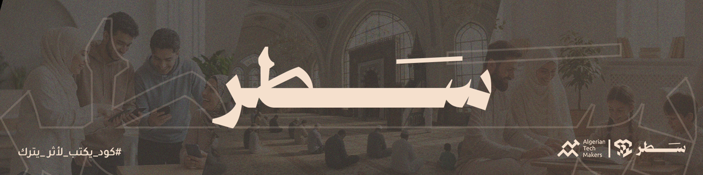

  

# سَطْر

## 👈🏻 تعريف بالمبادرة
مبادرة تستهدف المطورين نسعى من خلالها لفتح المجال لهم لتطوير برمجيات تهدف لخدمة مجتمعهم وأمتهم، وفي نفس الوقت تطوير مهاراتهم.

## 👈🏻 الفئة المستهدفة
المطورون الذين يريدون تطوير مهاراتهم في البرمجة (سواء تطبيقات أو مواقع)، وتسخيرها لتقديم خدمة للمجتمع والأمة.

---

## 🚀 مشاريع المبادرة
نضع هنا المشاريع مفتوحة المصدر التابعة للمبادرة، ويمكن لأي مطور المساهمة فيها.

### 1) المنزل الآمن 🏠 (elFulk-Project)
**الفكرة:** أطفالنا اليوم أمام عالم افتراضي مفتوح، للأسف كل شيء فيه متاح بلا قيود… فكان الهدف إنشاء فضاء رقمي موجّه للطفل المسلم تحت إشراف والديه، يضم محتوى نافع وآمن ومتوافق مع قيمنا.

**يشمل:**
- 🔸 برامج ومقاطع تعليمية هادفة  
- 🔸 قصص وسيرة نبوية بأسلوب مبسّط  
- 🔸 روابط ألعاب تعليمية آمنة  
- 🔸 دورات مجانية مخصصة للأطفال  
- 🔸 موارد للآباء لمساعدتهم في التربية والرعاية  

**يهدف المشروع إلى:**
- إغناء أولياء الأمور عن عناء البحث المتكرر.
- تمكينهم من إضافة اقتراحات وتجارب مجرّبة ومشاركتها مع الآخرين عبر التصويت والإشراف.

**أهم تحديات المشروع:**
1. الوصول إلى المحتوى المناسب بسبب تنوّع المواد (قصص، سيرة، رياضيات، برمجة، لغات...).
2. مراعاة ما يناسب عمر كل طفل (الموضوع + مدة المحتوى).
3. إتاحة الإضافة للأولياء مع الإشراف ومتابعة التصويت.
4. توافق التطبيق مع الهوية العربية الإسلامية (المحتوى + أسلوب العرض + تصميم الواجهة).

🔗 رابط المشروع: https://github.com/SATR-ATM/elFulk-Project

---

## 🤝 المساهمة
نرحب بكل مساهمة: (تصميم، تطوير، اختبار، توثيق، اقتراحات محتوى…)
- ابدأ من هنا:
- [CONTRIBUTING.md](../profile/CONTRIBUTING.md)

## 📜 الرخصة
هذا العمل مفتوح المصدر وفق الرخصة الموضحة في:
- [LICENSE](../LICENSE)

---

## 💡 مقترحات مشاريع جديدة
إذا عندك فكرة مشروع يخدم المجتمع/الأمة ويطوّر مهارات المطورين:
- افتح Issue في أحد مستودعاتنا (أو تواصل معنا عبر قنوات المبادرة إن كانت متاحة).
